# Heart-Disease-Analysis-Classification
In-depth Analysis of Heart Disease Dataset from Kaggle 
## Inroduction
The dataset which is going to be used in this research is from <a href="https://Kaggle.com" target="_blank">Kaggle.com</a>  which contains the 13 features 
on the basis one can predict whether a user is suffering from heart disease or not. Following are the 13 
features and a target label which is representing whether a user have heart disease or not.
  
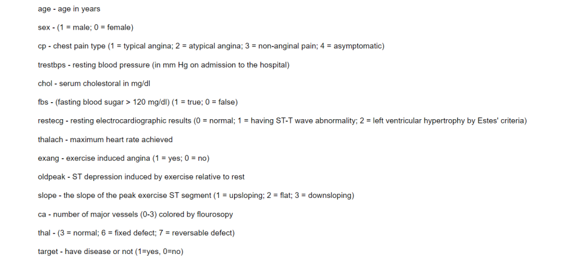
  
## Preprocessing
Before giving an input to machine learning model, it is important to perform certain actions on the 
data to improve the performance of the model.

As K-Nearest Neighbor is also being used as
machine learning model and it uses distance formula (Euclidean Distance or Manhattan Distance). 
In distance formula it is important that all the values must lie in the same range or scale. This Heart 
dataset contains features as numeric values as shown in image below so, it is important to scale 
down all the features to the same range of values so that the machine learning models can easily 
work on these features and give the best possible results.
  
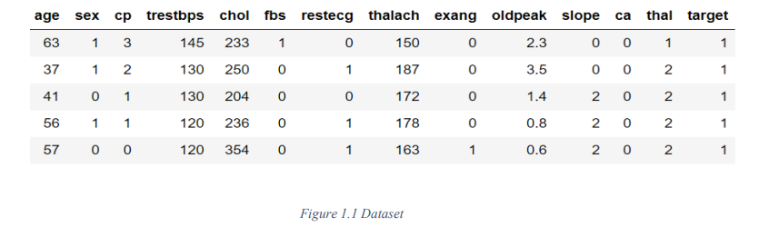
  

To scale down the features ‘MinMaxScaler’ was used from sklearn package which provide a 
function for scaling down the features. As few features are representing the classes in numeric 
form such as ‘Sex’ [0=Female, 1=Male] so, these types of features were not taken into 
consideration for scaling. Scaling was performed on ['age', 'trestbps', 'chol', 'thalach', 'oldpeak'] 
only because these were the actual numeric features and the rest were representing classes as 
shown in Dataset Section above. The dataset after scaling is shown below.
  
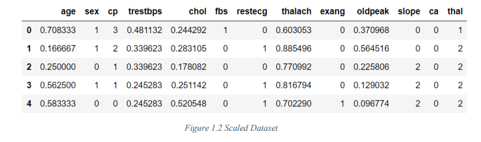
  

## Data Exploration

The major problem that can occur is imbalance class distribution which makes the machine learning 
model biased to a particular class(es). A dataset is said to be imbalance when there is a huge difference 
in the number of examples or samples of each class, that lead the machine learning model biased to 
the class which have higher samples. The question arise why is it so? Let’s assume having 1,000 
samples for ‘class A’ which says a patient have a heart disease and 100,000 samples for ‘class B’ 
which says a patient do not have a heart disease. The machine learning model gets train on this dataset 
but the model will understand the features of ‘class B’ better than the ‘class A’ because there are more 
number of samples for it. The model will have a better prediction for ‘class B’ but what about ‘class 
A’? Assume a scenario when unseen sample comes from the heart patient but the model predicts that 
the patient does not have a heart disease, the model is going to be lethal in this case. So, to avoid this 
problem it is always recommended to make these number of samples equal for all classes if it isn’t 
already.

The below figure showing the distribution of classes is almost equal which means there is no chance 
of imbalance dataset in our case. So, not to worry about the classes distribution.

  
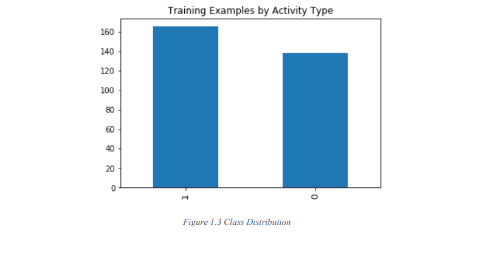
  

  
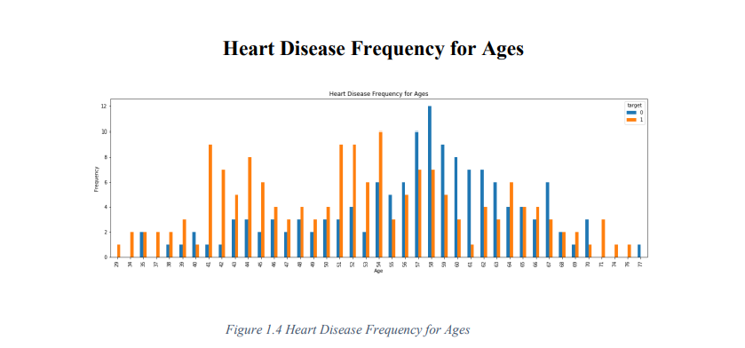
  

The above graph represents the frequency of Ages for persons who are having a heart disease or not. 
Above graph is showing that a person having age ranging from 36 to 54 is most likely to have a heart 
disease.

  
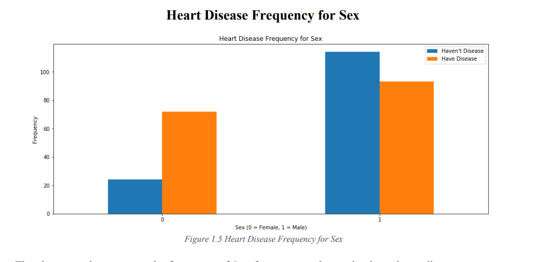
  

The above graph represents the frequency of Sex for persons who are having a heart disease or not. 
Above graph is showing that the ratio of female having heart disease is higher than the male.

  
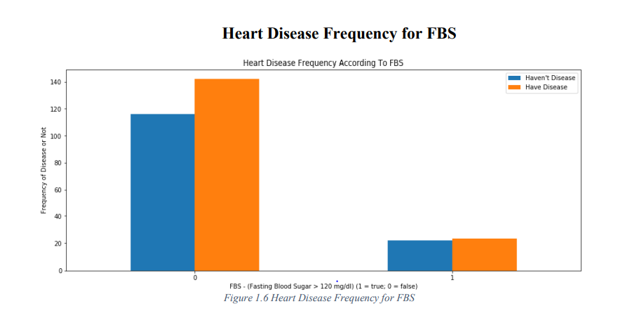
  

The above graph represents the frequency of Fasting Blood Sugar (FBS) for persons who are having 
heart disease or not. Above graph is showing that the person having FBS lower than 120 mg/dl is 
more likely to have heart disease than the ones who have FBS higher than 120 mg/dl.
  

> Correlation Matrix Using Heatmap Plotting
  
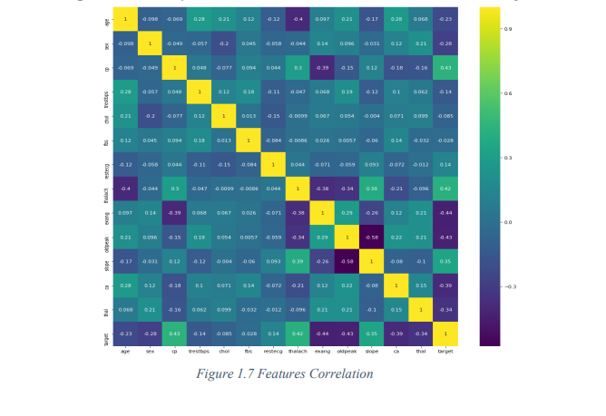
  

  
## Machine Learning Algorithms:

1. Principal Component Analysis:

    PCA is a technique which is helpful to analyze that how many optimum clusters your dataset may 
    have. For this purpose, the PCA converts the multidimensional data of your dataset into two 
    dimensions and then you can visualize the optimal number of clusters using Elbow, Bar Charts. If 
    your data is already in two dimensions, then you can also use scatter plot to visualize your clusters.

    This one is bar chart used for selecting optimal number of clusters. When I pass my dataset to 
PCA, it generates the Variance Bar Chart. If there is variance between these bars this means that 
there is need of separate cluster for this feature. Otherwise, if there is no variance that means this 
is the optimal point which tells you how many optimal clusters you may have in your dataset.

  
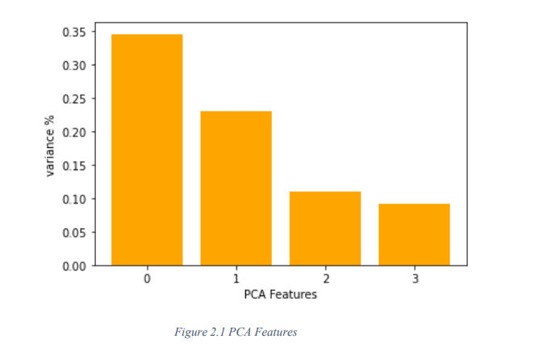
  

Elbow Method is also one of the method used for selecting optimal number of clusters. If there is 
some distance measure in previous and next cluster, then there is a need of clusters and if there is 
constant distance between clusters then before this point will be your optimal clusters for your 
dataset.

  
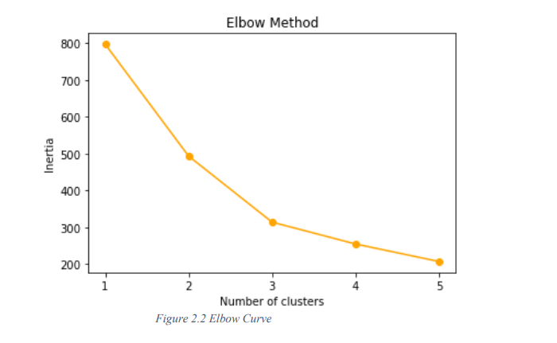
  

After converting Multi-dimensional feature of our dataset into two dimensions we are plotting 
these points using scatter plot. On the X-axis we take PCA Feature 1 and on the Y-axis we take 
feature 2.

  
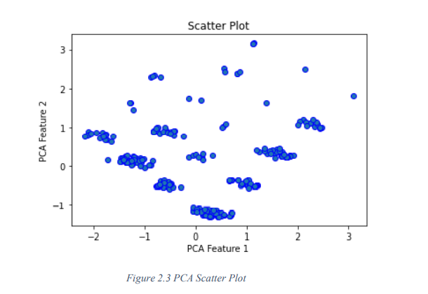
  

### K-Means Clustering:

In this Algorithm you have to first tell your algorithm what is the value of K that means you have 
to tell your Algorithm how many clusters you actually want.Then the algorithm will select the 
random data points of length K which you assign at the beginning of your algorithm. Then the 
algorithm will calculate the distance of each data points with randomly selected data points and 
this distance measure can be Euclidian, Manhattan or any other. 

> Input Parameters
1) n_clustersint: The number of clusters to form as well as the number of centroids to generate.
2) max_iter: Maximum number of iterations of the k-means algorithm for a single run.
3) init: (Method for initialization)

  
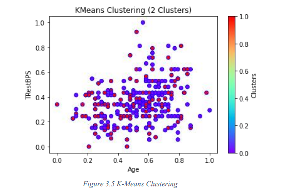
  

## Classification Algorithms:
 
Decision Tree was also used compare the results of predicting the Heart Disease Dataset. Decision 
Tree is s supervised machine learning model which take the features and labels and construct a 
tree kind shape. The constructed tree in our case is shown below. Each node in this tree represents 
the feature where the root node is the most relevant or important feature. The priority of features 
is selected based on the Information Gain which is discussed below.

  
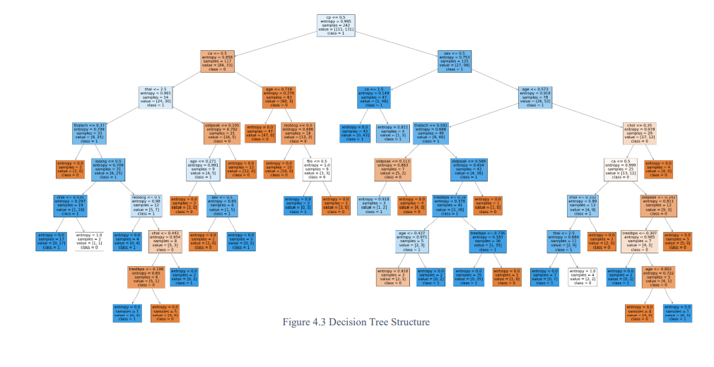
  

The parameters for Decision Tree was also selected by Hyper parameter tuning using 
GridSearchCV with 10 cross validations. The parameters which were taken into consideration for tuning 
are shown below.

  
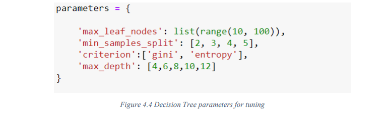
  

### Confusion Matrix For Decision Tree:
  
Decision Tree model is having 23 correct predictions and 4 wrong predictions for class 0 (Patients 
who do not have heart disease) whereas for class 1 (Patients who have heart disease) it is having 
25 correct predictions and 9 wrong predictions.

  
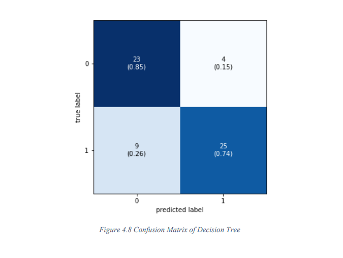
  

### Precision For Decision Tree:

  
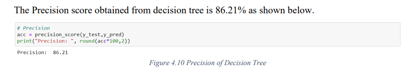
  

### Recall For Decision Tree:

  
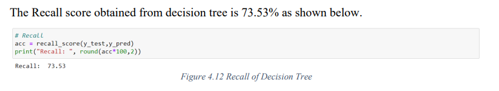
  
